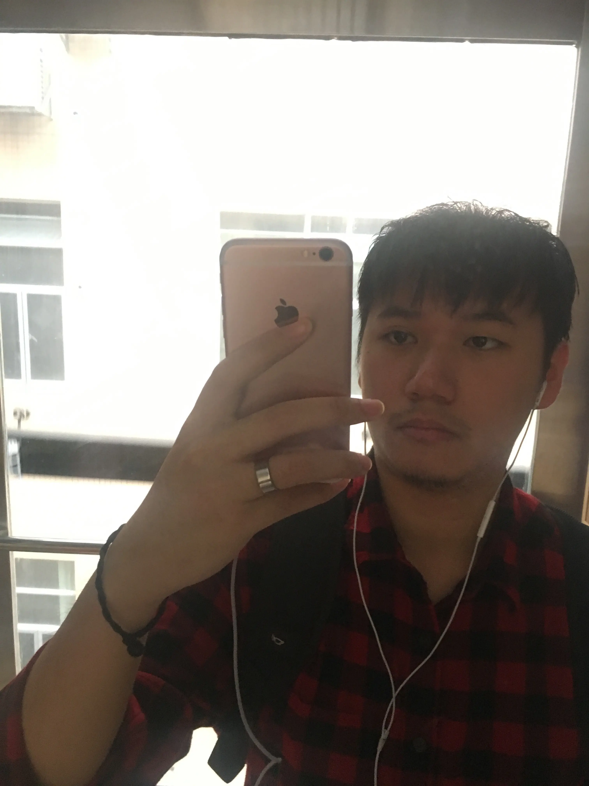

<!---->

博客里大部分是技术文章的翻译，偶尔自己写写文章总结，欢迎可以留言一起交流。也可以通过 [Twitter](http://twitter.com/kemchenj) || [Email](mailto:chenkem@gmail.com) || [Telegram](https://t.me/kemchenj) 联系我，希望跟多一些热爱技术的人做朋友，叫我**四娘**就可以了。

如果想要转载文章的话，请自便，右上角入口可以直接获取到 markdown 源文件，作者和来源都可以不标，不要洗稿即可。

个人履历：

- [iOS 周报](https://github.com/SwiftOldDriver/iOS-Weekly)编辑 2018 - 至今
- WWDC 内参：
    - 2021：[WWDC21 内参](https://xiaozhuanlan.com/wwdc21)校对审核
    - 2020：[WWDC20 内参](https://xiaozhuanlan.com/wwdc20)
    - 2018：[老司机x知识小集xSwiftGG WWDC 18 专题目录](https://juejin.im/post/5b1d284df265da6e572b3d87)
    - 2017：[WWDC 17内参](https://xiaozhuanlan.com/wwdc17)
- [Swift 官方文档](https://swift.org/documentation/)的[翻译更新工作(3.x - 4.x)](https://github.com/SwiftGGTeam/the-swift-programming-language-in-chinese)

[简历地址](/resume)
