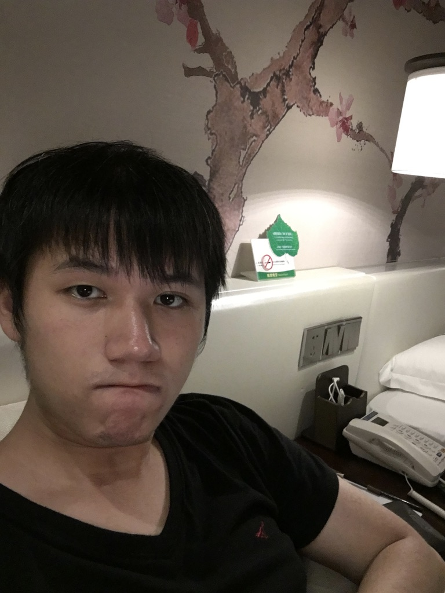

博客里大部分是技术文章的翻译，偶尔自己写写文章总结，欢迎可以留言一起交流。也可以通过 [Twitter](http://twitter.com/kemchenj) || [Email](chenkem@gmail.com) || [Telegram](https://t.me/kemchenj) 联系我，希望跟多一些热爱技术的人做朋友，叫我**四娘**就可以了。

个人履历：

- 2016 年开始学习编程，**量产型 iOS  菜鸟，基础恶补中**；
- 2016 年加入 [SwiftGG](http://swift.gg)，参与翻译技术文章；
- 2017 年参与[《WWDC 17内参》](https://xiaozhuanlan.com/wwdc17)，负责其中三个小节；
- 2017 年参与 [Swift 4.0 中文文档](https://github.com/SwiftGGTeam/the-swift-programming-language-in-chinese)的[翻译更新工作](https://github.com/SwiftGGTeam/the-swift-programming-language-in-chinese/blob/gh-pages/source/chapter2/27_contributors.md)；
- 2018 年参与 [iOS 周报](https://github.com/SwiftOldDriver/iOS-Weekly) 至今。
- 2018 年参与[《老司机x知识小集xSwiftGG WWDC 18 专题目录》](https://juejin.im/post/5b1d284df265da6e572b3d87)，负责其中一个小节；
- 2018 年参与[《SwiftOldDriver 精选》](https://xiaozhuanlan.com/olddriver-selection)；

